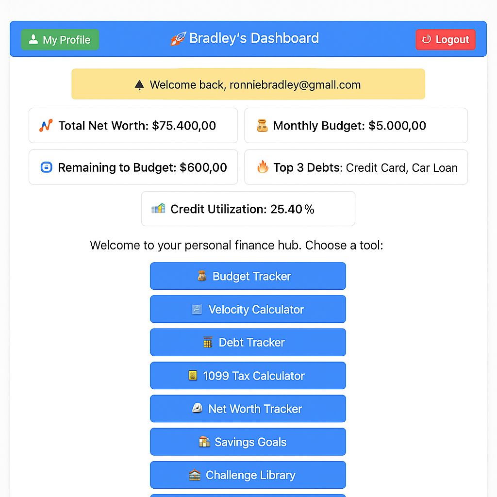
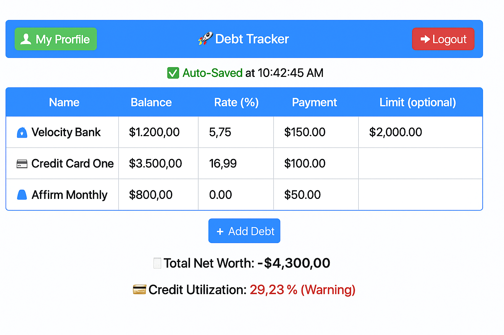

# 💼 Velocity Banking Toolkit

A powerful, real-time personal finance dashboard built with Firebase and HTML/CSS/JS. This toolkit helps users master their money using velocity banking principles, debt payoff automation, budgeting, and net worth tracking — all in one intuitive app.

---

## 🚀 Features

- 🔐 **Firebase Authentication**
- 💳 **Real-Time Debt Tracker** (with Avalanche/Snowball logic)
- 📊 **Credit Utilization Monitor** with badge alerts
- 💰 **Monthly Budget Planner**
- 🧮 **Net Worth Calculator**
- 📟 **1099 Tax Estimator**
- 📥 **Notifications Center**
- 📋 **Savings Goal Tracker**
- 🧾 **Master Activity Feed** (auto-logs all changes)
- 🔄 **Offline Support** via Firestore cache
- 🌐 **Responsive Web Design**
- 🧠 **Smart local caching** with fallback UI
- 🌓 Optional: Dark Mode Toggle (via theme preference)

---

## 📂 Project Structure

```
├── index.html               # Main dashboard (loads other tools)
├── budget.html              # Monthly budgeting tool
├── Debt_Tracker.html        # Avalanche/Snowball debt planner
├── Velocity_Calculator.html # Velocity banking simulator
├── net_worth_tracker.html   # Asset vs. liability tracker
├── 1099_calculator.html     # Tax estimate for self-employed
├── savings_goal_tracker.html
├── activity_feed.html       # Master audit trail
├── notifications.html
├── global.js                # Global Firebase/auth logic
├── favicon.ico              # Custom blue RB favicon
├── manifest.json            # PWA manifest (optional)
├── theme.css                # Theme support
├── service-worker.js        # Offline caching (optional)
├── .firebaserc              # Firebase project reference
├── firebase.json            # Firebase hosting config
├── icons/
│   ├── icon-192.png          # PWA app icon (192x192)
│   └── icon-512.png          # PWA app icon (512x512)
```

---

## 🔧 Installation & Setup

1. **Clone this repo**
   ```bash
   git clone https://github.com/your-username/velocity-banking-toolkit.git
   ```

2. **Firebase Setup**
   - Create a Firebase project at [firebase.google.com](https://firebase.google.com)
   - Enable:
     - 🔐 Authentication (Email/Password)
     - 🔥 Firestore Database
   - Replace your `firebaseConfig` in `index.html` with your project credentials

3. **Deploy to Firebase Hosting**
   ```bash
   firebase login
   firebase init hosting
   firebase deploy
   ```

4. **Or run locally**
   Just open `index.html` in your browser.

---

## 🧠 Concepts Behind This App

- **Velocity Banking**: Use lines of credit to chunk down high-interest debt faster while maintaining cash flow control.
- **Credit Utilization**: Key driver of your credit score — tracked live.
- **Real-Time Data**: Built with Firestore `.onSnapshot()` listeners.
- **LocalStorage Fallback**: Ensures a smooth offline-first experience.
- **Audit Trail**: Every financial action is timestamped and recorded.

---

## 📸 Screenshots

### 🔷 Dashboard View


### 🔶 Debt Tracker


### 💰 Budget Tracker


---

## 👨‍💻 Tech Stack

- Firebase Auth + Firestore
- Vanilla JS (no frameworks)
- HTML5 + CSS3
- PWA-ready structure

---

## 📦 Future Improvements

- 📱 Mobile app via Capacitor or Flutter
- 📄 PDF export (Debt summary, Budget reports)
- 📈 Charts using Chart.js
- 📆 Calendar-based reminders
- 🧑‍💼 Multi-user roles (Admin, Customer)

---

## 🧑‍💼 Maintainer

**Ronell Bradley**  
GitHub: [@ronb12](https://github.com/ronb12)

---

## ⭐️ Show Support

If you like this project, please ⭐️ the repo to support future updates!
